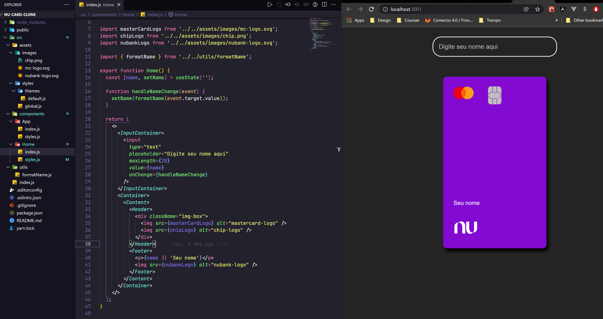
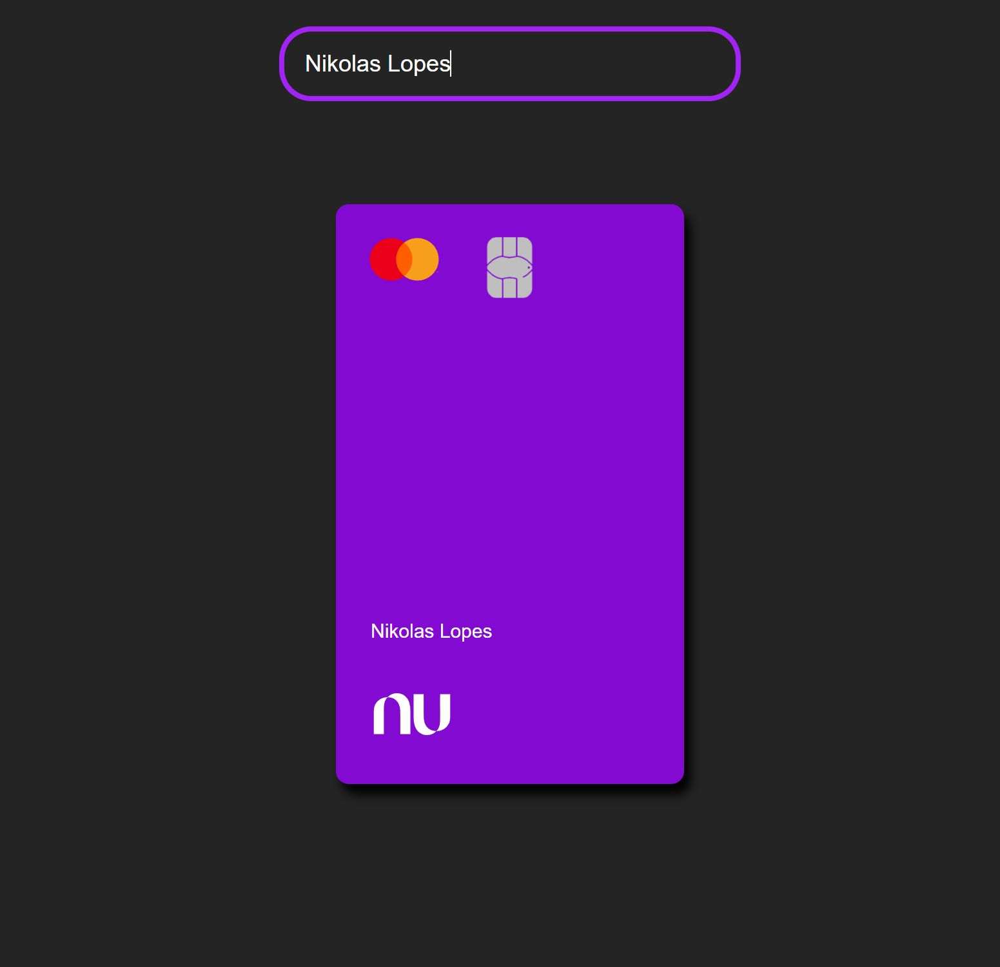

<h1 align="center">
   Nubank Card Clone 💳💜
</h1>

   

## Screenshots :camera_flash:	

  

  

  

## Run aplication :running_woman:	

Note :raised_hand:: _&nbsp;_  you can use the packages `yarn` or `npm` to run the project

Steps to run:

* Download the `zip project` or execute in the terminal: `https://github.com/nikolaslopes/nubank-card-clone.git`

* Open the folder in the terminal: `cd nubank-card-clone`

* Open the terminals and run: `yarn install`

* Then, run in terminal again: `yarn start`

* Open in the`Browser`: http://localhost:3000

  
    
## Techs :rocket:
- React ⚛
- Styled Components 💅🏻
- Framer Motion 🔮

    
  
   
## Author 

- GitHub: [nikolaslopes](https://github.com/nikolaslopes) :octocat:
- LinkedIn: [nikolas-lopes](https://www.linkedin.com/in/nikolas-lopes-b06524209/) 

 
  

Thanks for your support :shipit:

